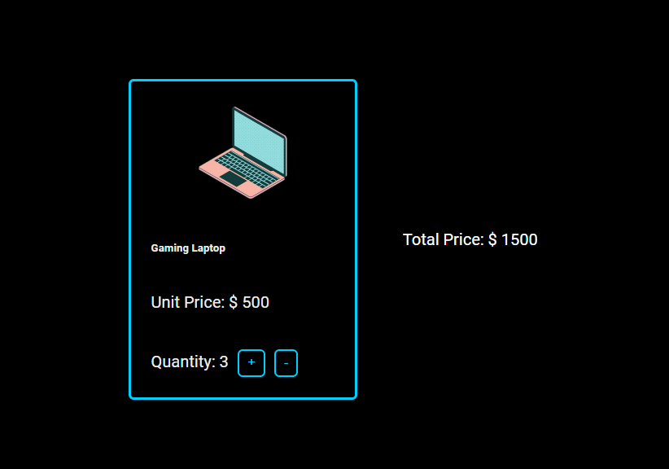

# Product Price Calculator

This is a simple **Product Price Calculator** that dynamically updates the total price based on the quantity selected. It simulates the functionality of an e-commerce website, allowing users to adjust the quantity of a product and see the total price change accordingly.

## Features
- Dynamic price calculation based on quantity.
- Display of unit price and total price in real-time.
- Buttons for increasing and decreasing the quantity.

## How It Works
The calculator uses basic JavaScript to:
1. Update the quantity when the "+" or "-" buttons are clicked.
2. Recalculate the total price by multiplying the unit price with the selected quantity.
3. Display the updated quantity and total price dynamically on the page.

## Preview

